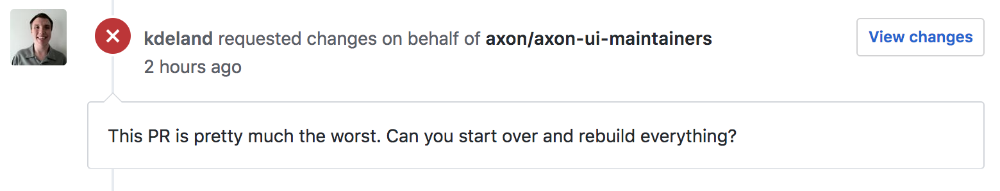
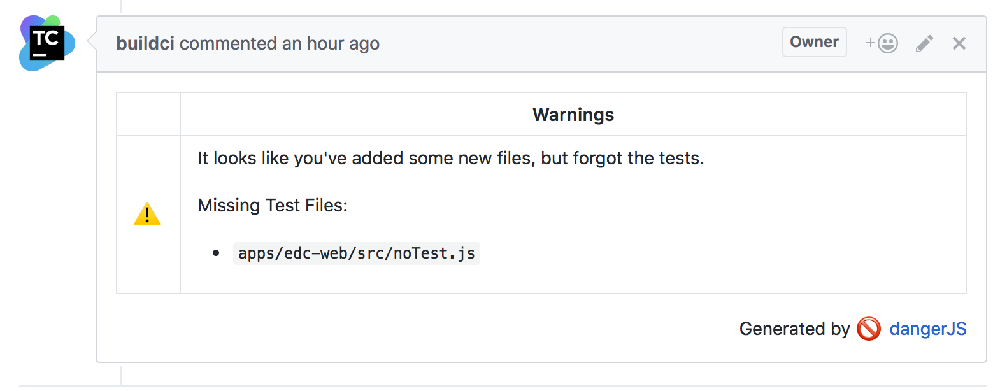
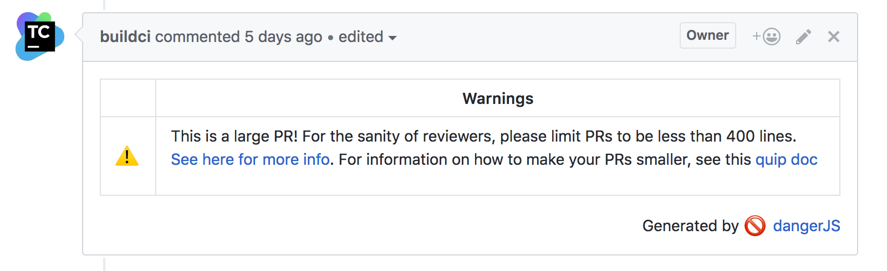

import { Appear, Image } from 'mdx-deck'
import { FullScreenCode } from 'mdx-deck/layouts'
import { theme } from 'mdx-deck/themes'

export { default as theme } from './theme'

# Making Better PRs through Automation
## a.k.a. how to stop saying "Get off my lawn!"
---
# About Me
Some stuff about me.
<Image src="Family.jpg" css={{ width: '30vw' }} size="contain" />
---
# What I do
<div style={{
  position: 'relative',
  height: '70vh',
  width: '100vw'}}>
<Appear>
  <Image src="RedactionStudio.png" size="contain" css={{
    position: 'absolute',
    top: '0',
    width: '100%',
    height: '100%',
  }} />
  <Image src="Red_X.svg" size="contain" css={{
    position: 'absolute',
    top: '0',
    width: '100%',
    height: '100%',
  }} />
</Appear>
</div>
---
# Imagine this...
<Appear>
  
  
</Appear>

```notes
You are doing your 3,042nd code review of the day and are leaving your favorite comment...
Eventually you feel like just saying.
```
---
<Image src="old_man.png" size="contain" />
---
# Enter DangerJS!

> Danger runs during your CI process, and gives teams the chance to automate common code review chores.

In other words, you can make the robot the bad guy!
---
# Before entering the Danger Zone...

Create Team Standards + Rules.
```notes
One of the primary purposes of a code review is to make sure that code is meets team criteria + standards.
Once the rules are in place, automation becomes a little easier.
```
---
# Setting up Danger
---
# Getting set up
1. Install Danger in your project
2. Create a bot account for Danger to post to your Code Review (currently only support for GitHub)
3. Tell your CI how to pass the access token / GitHub URL / current Pull Request number to Danger
4. Create a Dangerfile
5. Run it!
---
# New Rule: No Missing Tests

The Rule: Every new file our team creates should have a minimum test coverage of N%.
---
# Set-up

First, configure your test runner to output a JSON Coverage report:
```
jest --coverage --json --outputFile="./coverage-report.json"
```
---
# Danger Globals

Tools provided by Danger for working with modified/added files:
* `danger.git.created_files` - New Files
* `danger.git.deleted_files` - Files that were removed
* `danger.git.modified_files` - Files that were changed.
---
export default FullScreenCode

```js
const MINIMUM_TEST_COVERAGE = 0.5

const jsFileTest = /.js$/
const testFileTest = /.test.js$/
const storiesFileTest = /.stories.js$/

const filesNeedingTests = danger.git.created_files
  .filter(f => isJsFile(f) && !isTestFile(f) && !isStorybookFile(f) && !whiteListedFiles.includes(f))
  .filter(f => {
      // The path in the test report is an absolute path.
      const absPath = path.resolve(f)
      const report = testReport[absPath]

      // If there's no report, this file isn't part of a coverage, so should not be included.
      if (!report) {
        return false
      }

      const { statements: { pct } } = report
      return pct < MINIMUM_TEST_COVERAGE
    }))
```
---
# Reporting to the PR

Danger provides utilities for how it will post to the Pull Request:
* `danger.info` - Tidbits
* `danger.warn` - Draw attention
* `danger.fail` - Request Changes on the PR.
---
export default FullScreenCode

```js
if (filesNeedingTests.length) {
  const filesNeedingTestsOutput = filesNeedingTests.
    map(f => .map(f => '- `' + f + '`')).join('\\n')
  const output = `It looks like you've added some new files, but forgot the tests.
  
  Missing Test Files: 
  ${filesNeedingTestsOutput}`
  warn(output)
}
```
---
# Behold!


---
# New Rule: Preserve Reviewer Sanity

The Rule: Encourage developers to keep their PRs under 400 LoC.
---
export default FullScreenCode

```js
const LARGE_PR_LINES = 400

if (danger.github.pr.additions > LARGE_PR_LINES) {
  warn('This is a long PR. For the sanity of reviewers,'
    + 'please limit PRs to be less than 400 LoC')
} 
```
---
# Behold!


---
# But does it work?
Graph showing the total number of unit tests in our front end code base:
<Image size="contain" src="total_test_count.png" />
---
# And More...
* Report ESLint Failures
* Report Stylelint Failures
* Commit fixable linter changes
* Report Unit Test Failures
* ...
---
# Wait..I thought this was a React Meetup!
* Ensure that components have Storybooks
* Ensure components have READMEs
* The Sky is the limit...
---
# Any Questions?
---
# Interested in building better tooling?

We're hiring!